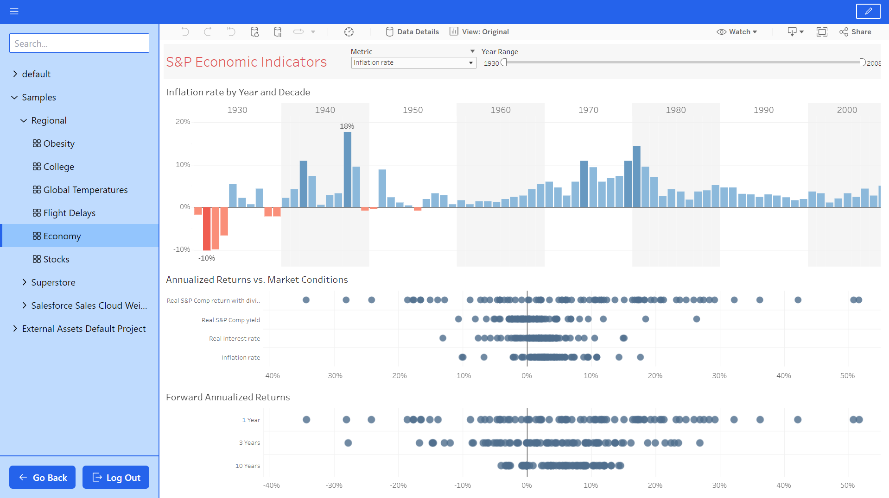

## Inspiration

My inspiration to work on this particular project stems from my recent internship experience with a business intelligence company. During my internship, I was exposed to various BI tools, including Tableau. As a software developer, I became intrigued by Tableau's development tools and started exploring them further for my internship work.

Shortly after, I registered for the Tableau Developer program, which led to me receiving an email about the Tableau DataDev Hackathon. Recognizing it as a valuable opportunity to enhance my skills, create something meaningful, and potentially win prizes, I decided to participate in the hackathon.

To ensure that my project addressed a genuine need in the industry, I discussed my idea with one of my mentors from the business intelligence company. They validated the concept and even provided valuable suggestions for additional features to include in my app. With their guidance, I was able to incorporate those suggestions, further enhancing the overall functionality and usefulness of my application.

## What it does

The Tableau Embedding webapp offers the following key features:

1. Embedding Tableau Sites: The app allows users to embed a Tableau site and display its content in a hierarchical structure, including projects, workbooks, and views.

2. User-Friendly Interface: The application presents the embedded Tableau content in a simple and intuitive user interface. Users can navigate through projects, workbooks, and views effortlessly, and access specific visualizations easily ensuring a smooth user experience.

3. Adding Tableau Sites: Users have the ability to add their own Tableau sites to their accounts within the application. This feature provides flexibility and allows users to access and manage multiple Tableau sites simultaneously.

4. Compatibility with Tableau Clouds: The app works seamlessly with both Tableau-hosted and self-hosted Tableau Clouds. This compatibility ensures that users can utilize the application regardless of their chosen deployment method.

5. Cross-Device Support: The entire application is designed to be responsive across various devices, including mobiles, tablets, and desktops. Users can access and utilize the app conveniently on their preferred device. Moreover, the views displayed within the application adapt to the screen size, providing a responsive layout ensuring optimal viewing and interaction.

6. In-App Editing: Users have the capability to edit the embedded views directly within the application. This feature empowers users to make small tweaks or customizations to the visualizations without leaving the app.

7. Quick Insights and Action: The app enables users, particularly non-technical users, to swiftly gain insights from visualizations and take necessary actions. This aspect is especially beneficial to individuals who may find Tableau's native interface complex but play a crucial role in leveraging data for their organizations.

## How I built it

I built the app using a combination of technologies and tools. After exploring various tech stacks and frameworks, I finalized React for the frontend and Node.js for the backend. The PostgreSQL database hosted on [Neon](https://neon.tech) served as the data storage solution.

To ensure smooth deployment, I utilized Docker and deployed the app as a Docker container on Google Cloud Run. The codebase was version controlled using Git and hosted on [GitHub](https://github.com/rushabhhere/tableau-embedding). Continuous deployment was achieved through a pipeline set up with Google Cloud Build.

For Tableau integration, I employed the Tableau Connected Apps concept and utilized the Tableau Embedding API v3 to embed views seamlessly. Additionally, the Tableau REST API was utilized to retrieve information about Tableau sites, projects, and workbooks.

## Challenges I ran into

- The app needs third-party cookies enabled to function properly. Third party cookies are disabled by default on iOS and iPadOS devices. Thus, this proves to be a limitation of the app that I haven't been able to fix.
- During one browser session, only one site from a Tableau Cloud domain can be embedded. For embedding another site from the same domain the browser needs to be restarted. This is due to the nature of the way embedding is achieved using Tableau Embedding API and is another limitation of the app.

## Accomplishments that I'm proud of

- Building a simple and easy to use UI that is responsive and works well on any screen size.
- Building something actually potentially useful.
- Being able to develop the application from scratch, making all design decisions, integrating several moving parts and deploying the application which is decently capable.

## What I learned

Firstly, I delved into the world of business intelligence (BI) tools and gained a comprehensive understanding of how companies and organizations leverage these tools to analyze and visualize data effectively. This experience deepened my knowledge of data-driven decision-making and the importance of empowering users with intuitive and accessible interfaces to extract valuable insights.

One crucial aspect that I discovered during my journey was the significant role played by non-tech-savvy users in the data utilization process. These individuals, while not necessarily well-versed in technical aspects, hold a vital position in extracting actionable insights from data visualizations built on Tableau. By building a self-service portal catering to their needs, I gained a deeper understanding of their use case and the challenges they face. This insight reinforced the importance of creating user-friendly tools that bridge the gap between complex data analytics and non-technical users, enabling them to make informed decisions.

From a development standpoint, I acquired a better understanding of utilizing Docker for containerization, allowing for efficient deployment and portability across different environments. Additionally, I implemented CI/CD (Continuous Integration/Continuous Deployment) pipelines using Google Cloud Build, which automated the deployment process and streamlined the development workflow. This experience enhanced my proficiency in building scalable and maintainable applications by incorporating industry best practices.

Overall, this project enabled me to learn not only about the significance of BI tools and their application in organizations but also about the specific needs of non-technical users and the importance of building intuitive self-service solutions for them. Moreover, I enhanced my technical skills by gaining hands-on experience with Docker and CI/CD pipelines, enriching my knowledge in software development practices.

## What's next for Tableau Embedding

I have several enhancements in mind to further improve the app's functionality and user experience:

1. Robust User Management System: I aim to develop a comprehensive user management system with organization accounts. This will enable organizations to have multiple members with varying roles, such as admins and regular members. The system will allow efficient management of user access, permissions, and collaboration within the app.

2. Refined User Interface: I recognize the importance of a polished and intuitive user interface. Going forward, I will focus on refining the UI to provide a visually appealing and user-friendly experience. This includes enhancing navigation, optimizing layouts, and improving overall usability.

3. Improved Performance: To optimize performance, I plan to implement techniques such as optimistic updates and caching. By leveraging optimistic updates, I can provide a snappier and more responsive experience to users, reducing latency when interacting with the app. Caching will further enhance performance by minimizing redundant data fetches and improving data retrieval speed.

4. Public API Offering: I intend to introduce a public API offering, allowing users to leverage the app's services in a headless manner. This will enable users to integrate the app's functionality into their own frontend applications, empowering them to create customized solutions that align with their specific needs.

5. Keeping Pace with Tableau's Developer Tools: Tableau's Developer Tools are continually evolving, and I am committed to staying up-to-date with their changes and improvements. I will actively monitor updates, new features, and best practices recommended by Tableau. By doing so, I can ensure that the app remains compatible with the latest advancements and incorporates any new capabilities that enhance the user experience.
